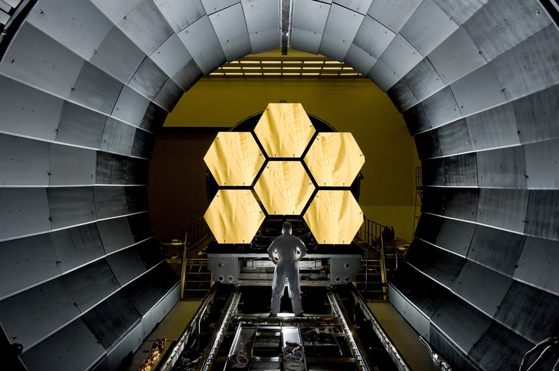

<!doctype html>
<html>
<head>
<meta charset="utf-8">
<title>groupworkProject</title>	  
<!--<link href="project.css" rel="stylesheet" type="text/css">-->
</head>

<body>

F I F T Y  -  5 0  5 0

Our Company FIFTY-50 is not only an engineering and design firm we also aim to use each team members ability in engineering along with a combination of creativity, skill, and the ability to analyse and synthesise in order to create successful designs. The product we recently made for Que interact shows each of those abilities in full flow. We also do not simply create designs and solutions we think about managing the design, delivery and maintenance of the automated equipment we offer. The design we created for que interact was cutting edge and modern and most importantly delivered on time in the upmost professional manner.

FIFTY-50 our company name symbolises many things. It symbolises the diversity we offer in our company it also symbolises how each member not only has to look out for themselves and their part of the project, each part and each step in this project is made with team work not one single part is made by one person it is a mixture of each team members genius 50/50. 

</body>
</html>
